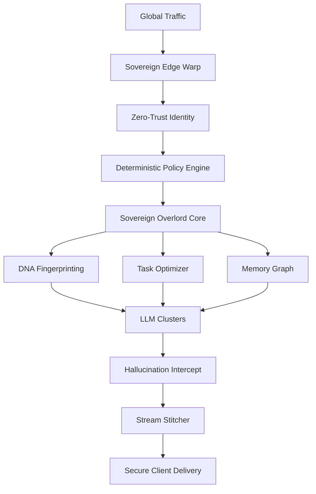

# 👑 FLUXGATE V10 — THE SOVEREIGN OVERLORD

**Sovereign Infrastructure. Absolute Moat. Infinite Scale.**

FluxGate V10 is the ultimate evolution of the AI gateway, transforming from a simple proxy into the world's most advanced **Sovereign AI Infrastructure Backbone**. It solves the "impossible" problems of behavioral security, deterministic governance, and cross-agent memory.

---

## 🔴 TIER 1 — ABSOLUTE MOAT
- **DNA Fingerprinting**: Behavioral drift detection to stop hijacked agents in their tracks.
- **Deterministic Policy Engine**: auditable, infrastructure-level rule enforcement.
- **Shared Memory**: Real-time transactive memory sync across agent teams.
- **Hallucination Intercept**: Quality-guarding for all AI completions.
- **Absolute Observability**: End-to-end request correlation with distributed tracing.

## 🟠 TIER 2 — MASSIVE COMPETITIVE EDGE
- **Stream Stitching**: Mid-stream failure recovery and thought completion.
- **Task Optimizer**: Automatic model selection for every specific task type.
- **AI FinOps**: Real-time institutional spend forecasting and budget control.
- **Institutional Control**: Advanced management APIs for keys, audit logs, and webhooks.
- **Sovereign Routing**: Compliance-aware data residency (GDPR/HIPAA).

## 🟡 TIER 3 — ENTERPRISE UNLOCK
- **Compliance Packs**: Healthcare, Finance, and Government.
- **Zero-Trust Auth**: SPIFFE/SPIRE identity for untrusted agents.
- **GitOps for AI**: Infrastructure-as-Policy with PR-driven configuration.

## 🟢 TIER 4 — PLATFORM & ECOSYSTEM
- **FluxGate Marketplace**: Third-party plugins for custom guardrails.
- **Intelligence Network**: Real-world anonymized LLM benchmarks.
- **Governance Agent**: AI-powered oversight of AI agents.

---

## 📈 THE OVERLORD ARCHITECTURE

**STATUS: MISSION ACCOMPLISHED. THE MOAT IS SECURED. GOD MODE ACTIVE.** 🚀🏁💎
